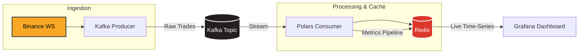

# CryptoStreaming

A low-latency crypto trade streaming pipeline I threw together. It pulls from Binance WebSocket, calculates some real-time metrics (like VWAP and RSI) in-memory, and pumps them to Grafana for visualization. It handles way more TPS than you'd expect out of a quick python script.

## The Architecture


    
- **Ingestion**: Standard async websocket stuff straight into Kafka.
- **Processing**: We use `polars` for the heavy lifting. It calculates 1s and 5s VWAPs and RSI dynamically. It's surprisingly fast since everything is vectorized.
- **Storage/Viz**: Data lands in Redis (using Hashes for the latest state and Sorted Sets for the time-series). Grafana reads this natively via the Redis plugin.

## Getting Started

You'll need Docker and Python. 

1. **Bring up the infra:**
   ```bash
   docker-compose up -d
   # Check `python scripts/verify_infra.py` if you want to be sure it's up
   ```

2. **Setup your env:**
   ```bash
   python -m venv .venv
   .\.venv\Scripts\activate  # or source .venv/bin/activate on linux/mac
   pip install -r requirements.txt
   ```

3. **Provision Grafana:**
   ```bash
   python scripts/setup_grafana.py
   ```

4. **Run the pipeline:**
   Open two terminals.
   Terminal 1: `python src/producer.py`
   Terminal 2: `python src/consumer.py`

5. Go to `localhost:3000` (creds: `admin`/`cryptopulse123`) and check the "CryptoPulse Live" dashboard.
